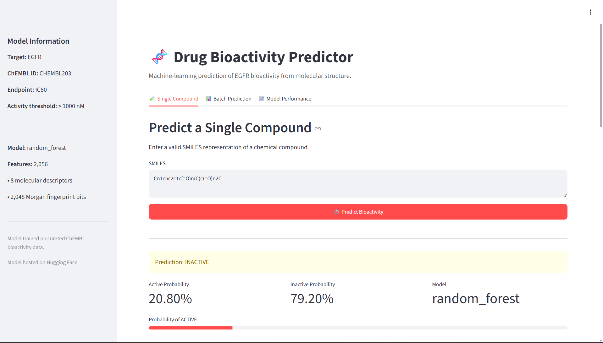

# 🧬 Drug Bioactivity Predictor

<p align="center">

An end-to-end cheminformatics and machine-learning pipeline for predicting **EGFR bioactivity** from molecular SMILES.

</p>

<p align="center">

**ChEMBL → Data Curation → RDKit → Molecular Features → ML → Scaffold Validation → Hugging Face → Streamlit**

</p>

<p align="center">

[](https://www.python.org/)
[](https://streamlit.io/)
[](https://www.rdkit.org/)
[](#testing)
[](https://docs.astral.sh/ruff/)
[](#license)

</p>

---

## 🌐 Application Preview



---

## 📌 Overview

**Drug Bioactivity Predictor** is a research-oriented machine-learning application that predicts whether a chemical compound is likely to be **ACTIVE** or **INACTIVE** against the **Epidermal Growth Factor Receptor (EGFR)** using its molecular structure represented as a SMILES string.

The project combines:

- ChEMBL bioactivity data
- Data curation and quality control
- RDKit cheminformatics
- Molecular descriptors
- Morgan fingerprints
- Classical machine-learning models
- Cross-validation
- Random train/test evaluation
- Bemis-Murcko scaffold validation
- Production inference
- Automated testing
- Code-quality checks
- GitHub Actions CI
- Hugging Face model hosting
- Streamlit deployment

The final selected model is a **Random Forest classifier**.

---

# 🎯 Problem Statement

Drug discovery involves evaluating large chemical libraries against biological targets.

Experimental measurements such as **IC50** are valuable but can be expensive and time-consuming to obtain. Computational models can be used as an initial prioritization mechanism to identify compounds that may warrant further investigation.

This project addresses the following problem:

> **Given a molecular SMILES representation, predict whether the compound is likely to exhibit activity against EGFR based on patterns learned from curated experimental IC50 measurements.**

The prediction is formulated as a binary classification problem.

```text
IC50 <= 1000 nM  → ACTIVE
IC50 > 1000 nM   → INACTIVE
```

## 🌐 Streamlit Application

https://drug-bioactivity-predictor.streamlit.app/
