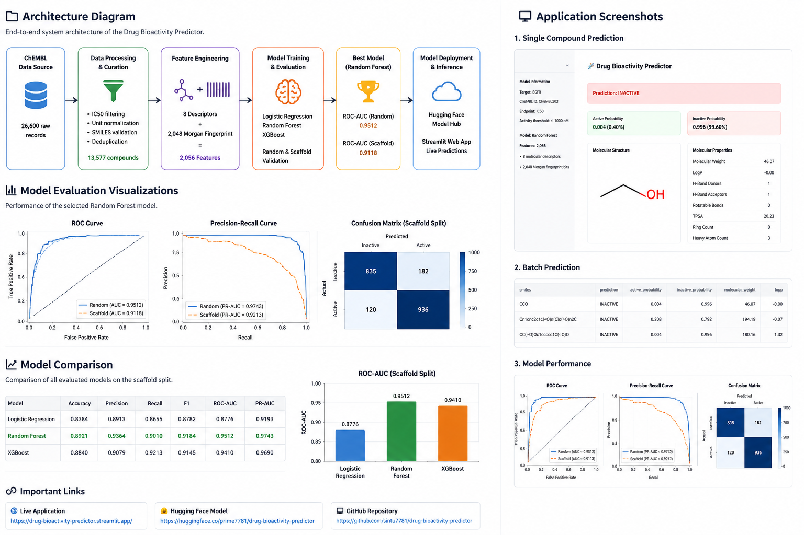
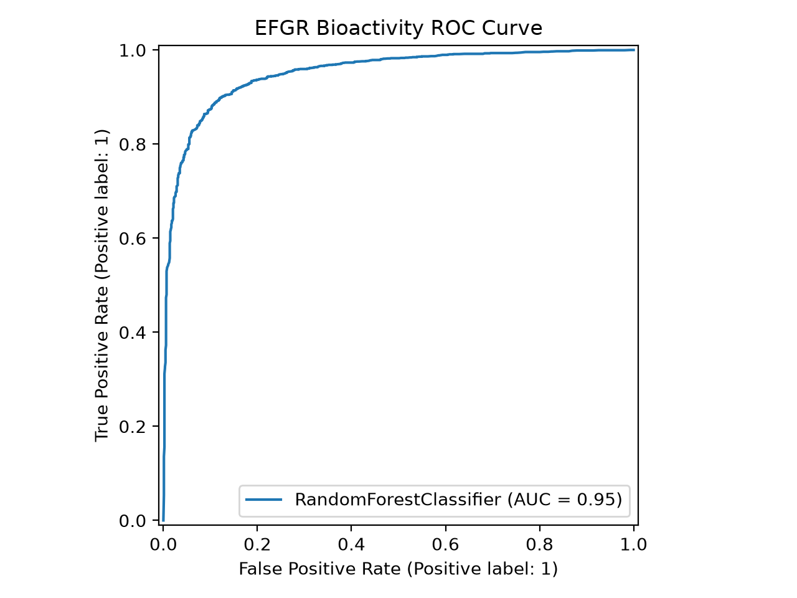
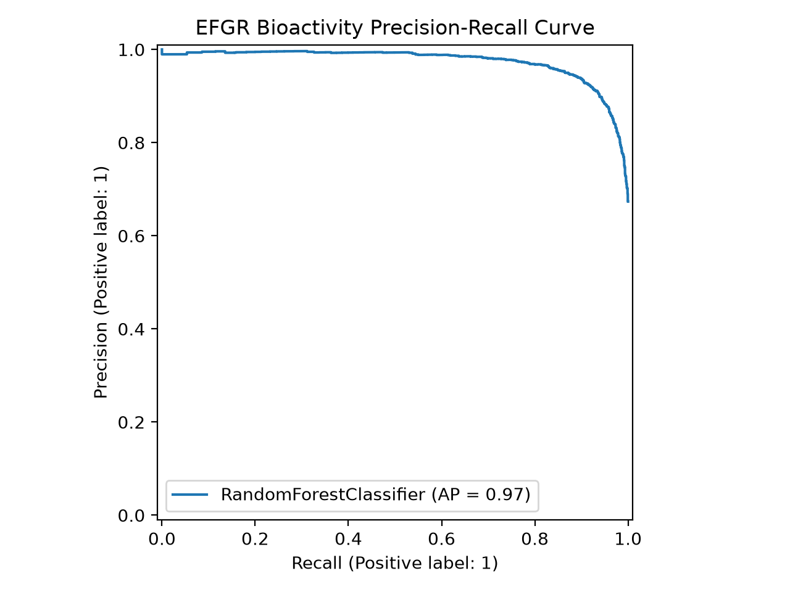
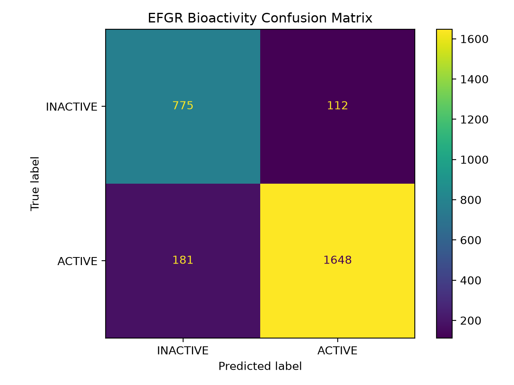

# 🧬 Drug Bioactivity Predictor

An end-to-end machine learning application for predicting **EGFR (Epidermal Growth Factor Receptor) bioactivity** from molecular SMILES strings.

The project uses **ChEMBL bioactivity data**, **RDKit molecular descriptors**, **Morgan fingerprints**, and multiple machine-learning algorithms to classify compounds as **ACTIVE** or **INACTIVE** against EGFR based on IC50 activity.

The trained Random Forest model is exposed through an interactive **Streamlit web application** and the model artifact is hosted on **Hugging Face**.

---

## 🚀 Project Overview



The complete pipeline consists of:

1. ChEMBL data acquisition
2. Data curation and quality control
3. SMILES validation
4. Molecular feature generation
5. Morgan fingerprint generation
6. Molecular descriptor calculation
7. Machine-learning model training
8. Cross-validation
9. Random train/test evaluation
10. Scaffold-based evaluation
11. Final model validation
12. Production inference
13. Streamlit deployment

---

## 🎯 Problem Statement

Drug discovery requires evaluating large numbers of chemical compounds against biological targets.

Experimental bioactivity measurements such as **IC50** are expensive and time-consuming to obtain. A machine-learning model can help prioritize compounds by predicting whether a molecule is likely to exhibit meaningful activity against a target.

This project focuses on:

> **Predicting whether a compound is active or inactive against EGFR using molecular structure represented by SMILES.**

The activity threshold used in this project is:

```text
IC50 <= 1000 nM  → ACTIVE
IC50 > 1000 nM   → INACTIVE
```

---

## 🧪 Target

| Property         | Value                 |
| ---------------- | --------------------- |
| Target           | EGFR                  |
| ChEMBL Target ID | CHEMBL203             |
| Activity Type    | IC50                  |
| Activity Unit    | nM                    |
| Active Threshold | 1000 nM               |
| Prediction Type  | Binary Classification |

---

## 📊 Dataset

The project uses EGFR IC50 bioactivity records obtained from ChEMBL.

### Dataset curation

Initial records:

```text
26,600
```

After unit filtering:

```text
25,244
```

Records with missing activity removed:

```text
142
```

Positive activity records:

```text
25,102
```

Invalid SMILES removed:

```text
19
```

Duplicate measurements removed:

```text
3,367
```

Final unique compounds:

```text
13,577
```

### Final class distribution

| Class     |  Compounds | Fraction |
| --------- | ---------: | -------: |
| ACTIVE    |      9,142 |   67.33% |
| INACTIVE  |      4,435 |   32.67% |
| **Total** | **13,577** | **100%** |

---

## 🔬 Feature Engineering

Each molecule is represented using two types of features.

### 1. Molecular descriptors

The following eight descriptors are calculated using RDKit:

- Molecular Weight (`MolWt`)
- LogP
- Hydrogen Bond Donors (`HBD`)
- Hydrogen Bond Acceptors (`HBA`)
- Rotatable Bonds
- Topological Polar Surface Area (`TPSA`)
- Ring Count
- Heavy Atom Count

### 2. Morgan fingerprints

Morgan fingerprints are generated using:

```text
Radius: 2
Number of bits: 2048
```

Therefore, the complete feature vector contains:

```text
8 molecular descriptors
+
2048 Morgan fingerprint bits
=
2056 features
```

The generated feature matrix is:

```text
Feature matrix: (13577, 2056)
Target vector:  (13577,)
```

---

## 🤖 Machine Learning Models

Three classification algorithms were evaluated:

1. Logistic Regression
2. Random Forest
3. XGBoost

The models were evaluated using:

- Accuracy
- Precision
- Recall
- F1 Score
- ROC-AUC
- PR-AUC
- Cross-validation ROC-AUC

---

## 📈 Model Performance

### Random train/test split

The dataset was divided into:

```text
Training samples: 10,861
Test samples:      2,716
```

| Model               |   Accuracy |  Precision |     Recall |         F1 |    ROC-AUC |     PR-AUC |
| ------------------- | ---------: | ---------: | ---------: | ---------: | ---------: | ---------: |
| Logistic Regression |     0.8384 |     0.8913 |     0.8655 |     0.8782 |     0.8776 |     0.9193 |
| Random Forest       | **0.8921** | **0.9364** |     0.9010 | **0.9184** | **0.9512** | **0.9743** |
| XGBoost             |     0.8840 |     0.9079 | **0.9213** |     0.9145 |     0.9410 |     0.9690 |

### Best model

```text
Model: Random Forest

Accuracy:  0.8921
Precision: 0.9364
Recall:    0.9010
F1 Score:  0.9184
ROC-AUC:   0.9512
PR-AUC:    0.9743
```

The Random Forest model was selected as the final model based primarily on its ROC-AUC performance.

---

## 🔄 Cross-Validation

Five-fold cross-validation was used to evaluate model stability.

### Logistic Regression

```text
Mean ROC-AUC: 0.8674
Std:          0.0044
```

### Random Forest

```text
Mean ROC-AUC: 0.9478
Std:          0.0054
```

### XGBoost

```text
Mean ROC-AUC: 0.9389
Std:          0.0059
```

Random Forest achieved the highest cross-validation ROC-AUC.

---

## 🧬 Scaffold-Based Validation

Random train/test splitting can produce overly optimistic estimates in molecular machine learning because structurally similar molecules can appear in both training and testing sets.

To evaluate chemical generalization, a **Bemis-Murcko scaffold split** was also performed.

### Scaffold split

```text
Training compounds: 10,850
Test compounds:      2,727
```

### Results

| Metric    | Scaffold Evaluation |
| --------- | ------------------: |
| Accuracy  |              0.8401 |
| Precision |              0.8760 |
| Recall    |              0.8884 |
| F1 Score  |              0.8822 |
| ROC-AUC   |          **0.9118** |
| PR-AUC    |              0.9551 |

---

## 🧪 Final Model Validation

The final validation compares random splitting with scaffold-based splitting.

```text
Random ROC-AUC:   0.9512
Scaffold ROC-AUC: 0.9118
```

Generalization gap:

```text
0.0394
```

This indicates that performance decreases when the model is evaluated on chemically different scaffold families, which provides a more realistic estimate of molecular generalization.

---

## 📉 Evaluation Figures

The project generates the following evaluation plots:

### ROC Curve



### Precision-Recall Curve



### Confusion Matrix



---

## 🧠 Prediction Pipeline

The production inference pipeline accepts a molecular SMILES string.

Example:

```text
CCO
```

The pipeline performs:

```text
SMILES
  ↓
RDKit molecular validation
  ↓
Canonical SMILES
  ↓
Molecular descriptors
  ↓
Morgan fingerprint
  ↓
2056-dimensional feature vector
  ↓
Random Forest
  ↓
Prediction probability
  ↓
ACTIVE / INACTIVE
```

---

## 🔍 Example Prediction

Example input:

```text
CCO
```

Example output:

```json
{
  "smiles": "CCO",
  "canonical_smiles": "CCO",
  "prediction": "INACTIVE",
  "prediction_label": 0,
  "active_probability": 0.004,
  "inactive_probability": 0.996,
  "model": "random_forest",
  "target": "EGFR",
  "target_chembl_id": "CHEMBL203",
  "activity_type": "IC50",
  "activity_unit": "nM",
  "active_threshold_nM": 1000
}
```

The application also calculates molecular properties such as:

- Molecular Weight
- LogP
- HBD
- HBA
- Rotatable Bonds
- TPSA
- Ring Count
- Heavy Atom Count

---

## 🌐 Live Application

The model is available through an interactive Streamlit application.

**Live Demo:**

<!-- > Add your Streamlit Cloud URL here after deployment. -->

```text
https://drug-bioactivity-predictor.streamlit.app/
```

The application allows users to:

- Enter a SMILES string
- Validate the molecule
- Generate molecular features
- Predict EGFR activity
- View active/inactive probability
- View molecular descriptors
- View canonical SMILES
- Inspect prediction details

---

## 🤗 Hugging Face Model

The trained model and model metadata are hosted on Hugging Face.

**Model Repository:**

https://huggingface.co/prime7781/drug-bioactivity-predictor

The repository contains the production model artifact and associated metadata.

---

## 🛠️ Technology Stack

### Programming

- Python

### Cheminformatics

- RDKit
- Morgan Fingerprints
- Bemis-Murcko Scaffolds

### Machine Learning

- scikit-learn
- Random Forest
- Logistic Regression
- XGBoost

### Data Processing

- NumPy
- Pandas
- SciPy

### Visualization

- Matplotlib

### Application

- Streamlit

### Model Serialization

- Joblib

### Testing

- Pytest

### Code Quality

- Ruff

### Model Hosting

- Hugging Face

### Version Control

- Git
- GitHub

---

## 📁 Project Structure

```text
drug-bioactivity-predictor/
│
├── app.py
├── README.md
├── requirements.txt
├── requirements-dev.txt
├── pytest.ini
├── run_pipeline.ps1
│
├── .streamlit/
│   └── config.toml
│
├── data/
│   ├── raw/
│   │   ├── egfr_ic50_raw.csv
│   │   └── egfr_ic50_with_smiles.csv
│   │
│   ├── processed/
│   │   ├── egfr_ic50_curated.csv
│   │   └── egfr_features.npz
│   │
│   └── sample_predictions.csv
│
├── docs/
│   └── project-overview.png
│
├── models/
│   └── model_metadata.json
│
├── notebooks/
│   └── 01_data_exploration.ipynb
│
├── reports/
│   ├── data_quality.json
│   ├── model_comparison.csv
│   ├── model_validation.json
│   ├── scaffold_evaluation.json
│   │
│   └── figures/
│       ├── confusion_matrix.png
│       ├── precision_recall_curve.png
│       └── roc_curve.png
│
├── src/
│   ├── __init__.py
│   ├── build_features.py
│   ├── config.py
│   ├── curate.py
│   ├── download_data.py
│   ├── download_molecules.py
│   ├── evaluate.py
│   ├── features.py
│   ├── final_evaluation.py
│   ├── logging_config.py
│   ├── pipeline.py
│   ├── predict.py
│   ├── preprocessing.py
│   ├── scaffold_evaluate.py
│   ├── scaffold_split.py
│   └── train.py
│
└── tests/
    ├── test_features.py
    ├── test_predict.py
    └── test_preprocessing.py
```

---

## ⚙️ Installation

Clone the repository:

```bash
git clone https://github.com/sintu7781/drug-bioactivity-predictor.git
```

Navigate into the project:

```bash
cd drug-bioactivity-predictor
```

Create a virtual environment:

### Windows

```powershell
python -m venv .venv
```

Activate it:

```powershell
.\.venv\Scripts\Activate.ps1
```

Install dependencies:

```powershell
python -m pip install -r requirements.txt
```

For development dependencies:

```powershell
python -m pip install -r requirements-dev.txt
```

---

## ▶️ Run the Streamlit Application

Start the application:

```powershell
python -m streamlit run app.py
```

The application will be available locally at:

```text
http://localhost:8501
```

---

## 🧪 Run Tests

Run the complete test suite:

```powershell
pytest
```

Current test status:

```text
15 passed
```

The tests cover:

- Molecular feature generation
- SMILES handling
- Prediction functionality
- Data preprocessing

---

## 🔍 Code Quality

Run Ruff:

```powershell
ruff check .
```

Current status:

```text
All checks passed!
```

---

## 🔄 Reproduce the ML Pipeline

The individual pipeline stages can be executed using:

### Data processing

```powershell
python -m src.preprocessing
```

### Feature generation

```powershell
python -m src.build_features
```

### Model training

```powershell
python -m src.train
```

### Model evaluation

```powershell
python -m src.evaluate
```

### Scaffold evaluation

```powershell
python -m src.scaffold_evaluate
```

### Final validation

```powershell
python -m src.final_evaluation
```

---

## 🧪 Model Validation Workflow

The project uses multiple evaluation strategies:

```text
                 Curated ChEMBL Data
                         │
                         ▼
                 Feature Generation
                         │
                         ▼
                 Train/Test Split
                    /          \
                   /            \
                  ▼              ▼
          Random Evaluation   Scaffold Evaluation
                  │              │
                  ▼              ▼
              ROC-AUC         ROC-AUC
                0.9512          0.9118
                   \            /
                    \          /
                     ▼        ▼
                  Final Validation
```

This approach helps distinguish ordinary predictive performance from performance on structurally different chemical scaffolds.

---

## 📦 Model Artifact

The production model is serialized using Joblib.

The trained model contains:

```text
Random Forest classifier
Feature count
Model name
Target information
Activity type
Activity unit
Activity threshold
Morgan fingerprint configuration
Descriptor configuration
```

The production model is hosted externally through the Hugging Face repository.

---

## 🔐 Reproducibility

The project records the following information required to reproduce inference:

```text
Target:
EGFR

Target ChEMBL ID:
CHEMBL203

Activity:
IC50

Unit:
nM

Active threshold:
1000 nM

Morgan radius:
2

Morgan fingerprint size:
2048

Descriptor count:
8

Total feature count:
2056
```

---

## ⚠️ Important Scientific Note

This model is a **research and prioritization tool**, not a replacement for experimental validation.

An `ACTIVE` prediction means that the molecular representation is associated with patterns learned from the curated training data. It does not establish that a compound will demonstrate biological activity experimentally.

Predictions should therefore be treated as computational hypotheses requiring experimental validation.

---

## 📚 Dataset and Scientific Resources

The project uses bioactivity data originating from the ChEMBL database.

- ChEMBL: https://www.ebi.ac.uk/chembl/
- RDKit: https://www.rdkit.org/
- scikit-learn: https://scikit-learn.org/
- XGBoost: https://xgboost.readthedocs.io/

---

## 🚀 Future Improvements

Potential improvements include:

- Hyperparameter optimization
- External validation using an independent dataset
- More rigorous temporal splitting
- Applicability-domain analysis
- Molecular similarity analysis
- Probability calibration
- Model explainability
- SHAP-based feature analysis
- Additional molecular fingerprints
- Graph neural network models
- Deep-learning-based molecular representations
- Expanded target coverage
- REST API deployment
- Containerized deployment where appropriate
- Automated CI/CD testing

---

## 👨‍💻 Author

**Sintu Kumar**

GitHub:

https://github.com/sintu7781

Project Repository:

https://github.com/sintu7781/drug-bioactivity-predictor

Hugging Face:

https://huggingface.co/prime7781/drug-bioactivity-predictor

---

## ⭐ Acknowledgements

This project makes use of open-source scientific and machine-learning technologies including:

- ChEMBL
- RDKit
- NumPy
- Pandas
- scikit-learn
- XGBoost
- Matplotlib
- Streamlit
- Pytest
- Hugging Face

---

## 📄 License

Add the project's license here if a license has been selected for the repository.
